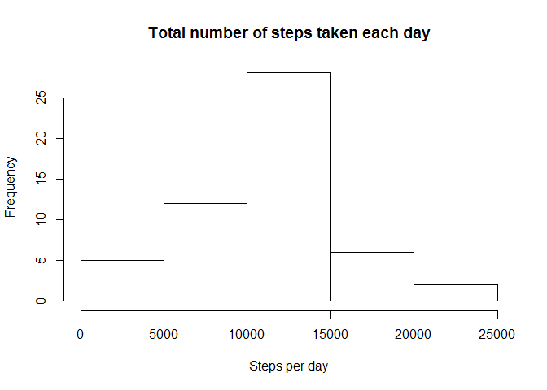
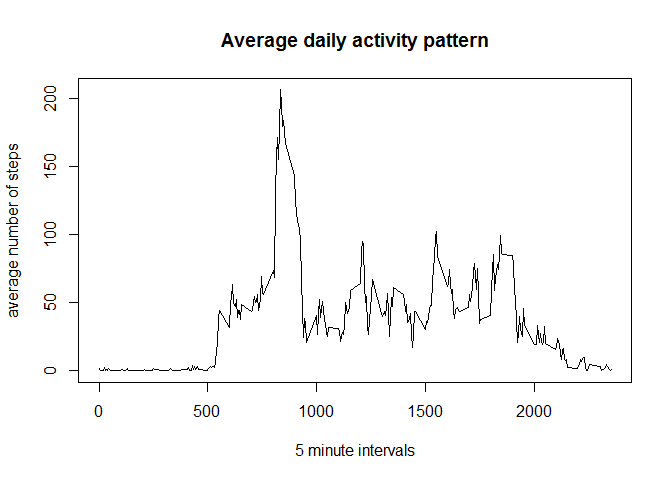
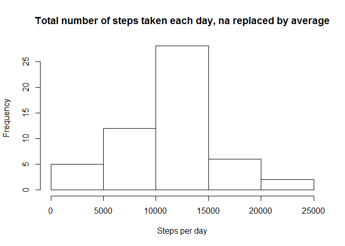
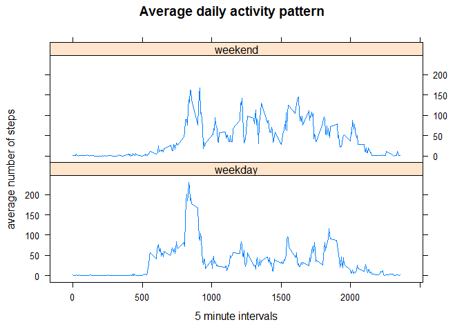

# Reproducible Research: Peer Assessment 1

```r
Sys.setlocale("LC_TIME", "English")
```

```
## [1] "English_United States.1252"
```

```r
require(RCurl)
```

```
## Loading required package: RCurl
## Loading required package: bitops
```

```r
require(lattice)
```

```
## Loading required package: lattice
```

## Loading and preprocessing the data

#### loading the data


```r
# retrieve activity file if needed
if (!file.exists("activity.zip")) {
    fileUrl <- "https://d396qusza40orc.cloudfront.net/repdata%2Fdata%2Factivity.zip"
    stream <- getBinaryURL(fileUrl, ssl.verifypeer=FALSE)
    dataFile <- file("activity.zip", open = "wb")
    writeBin(stream, dataFile )
    close(dataFile)    
}

# unzip activity if needed
if (!file.exists("activity.csv")) {
     unzip("activity.zip")
}
```

#### preprocessing the data


```r
# read csv
data <- read.csv("activity.csv")
```


## What is mean total number of steps taken per day?

#### histogram


```r
# create table with total steps per day
stepsPerDay <- aggregate(steps ~ date, data = data, sum)

hist(stepsPerDay$steps, freq=TRUE, xlab = "Steps per day", ylab="Frequency", main="Total number of steps taken each day")
```

 

#### mean and median


```r
mean(stepsPerDay$steps)
```

```
## [1] 10766.19
```

```r
median(stepsPerDay$steps)
```

```
## [1] 10765
```


## What is the average daily activity pattern?

#### time series plot


```r
# create table with activity pattern
meanStepsPerInterval <- aggregate(steps ~ interval, data = data, mean)
plot(meanStepsPerInterval$interval,meanStepsPerInterval$steps, type="l", xlab = "5 minute intervals", ylab="average number of steps", main="Average daily activity pattern")
```

 

#### 5-minute interval, on average across all the days in the dataset, with the maximum number of steps


```r
orderedData <- meanStepsPerInterval[order(meanStepsPerInterval$steps,decreasing = TRUE),]
head(orderedData,1)
```

```
##     interval    steps
## 104      835 206.1698
```

## Imputing missing values

#### Total number of rows with NAs

```r
nrow(data)- sum(complete.cases(data))
```

```
## [1] 2304
```

#### Replacing NA values with the mean of the steps in the interval

```r
dataNoNa <- transform(data, steps = ifelse(is.na(steps), ave(steps, interval, FUN = function(x) mean(x, na.rm = TRUE)), steps))
```

#### histogram

```r
# create table with total steps per day
stepsNoNaPerDay <- aggregate(steps ~ date, data = dataNoNa, sum)

hist(stepsPerDay$steps, freq=TRUE, xlab = "Steps per day", ylab="Frequency", main="Total number of steps taken each day, na replaced by average")
```

 

#### mean and median


```r
mean(stepsNoNaPerDay$steps)
```

```
## [1] 10766.19
```

```r
median(stepsNoNaPerDay$steps)
```

```
## [1] 10766.19
```

The mean doesn't differ from the mean of the dataset with missing values, the median is a only 1.19 higher then the median of the dateset with the missing values. Adding the mean value for the missing data in the dataset has little (to none) impact on the estimates of the total daily number of steps.

## Are there differences in activity patterns between weekdays and weekends?

#### adding weekday/weekend day factor


```r
weekendday <- c("Saturday", "Sunday")
dataNoNa$day <- factor(ifelse(weekdays(as.Date(dataNoNa$date)) %in% weekendday,"weekend", "weekday"))
```

#### panel plot

```r
meanStepsPerIntervalNoNa <- aggregate(steps ~ interval + day, data = dataNoNa, mean)
xyplot(steps ~ interval | day, data=meanStepsPerIntervalNoNa, type="l", layout = c(1, 2), xlab = "5 minute intervals", ylab="average number of steps",main="Average daily activity pattern")
```

 
